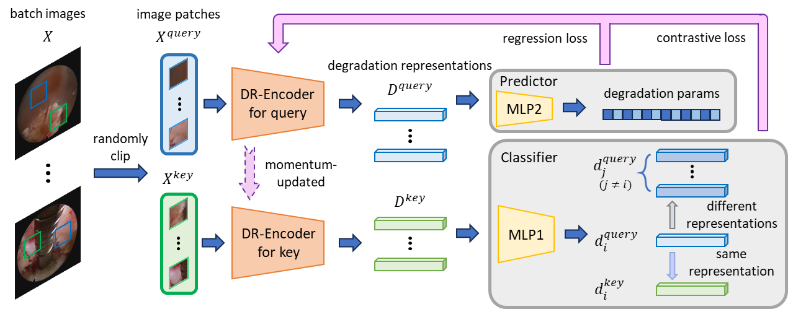
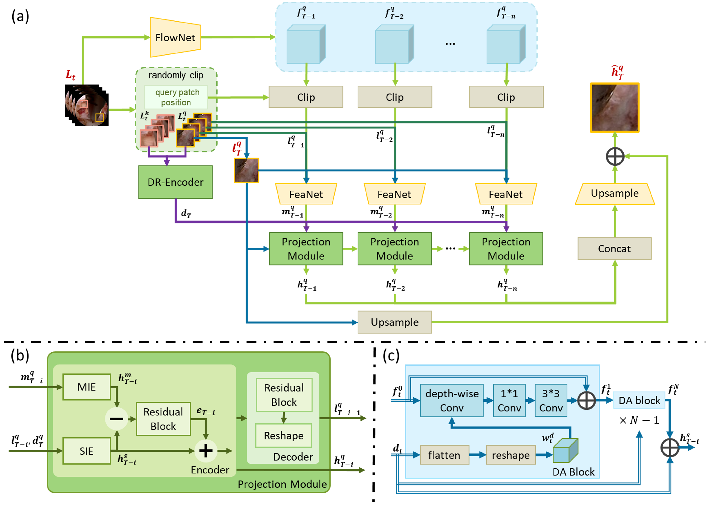
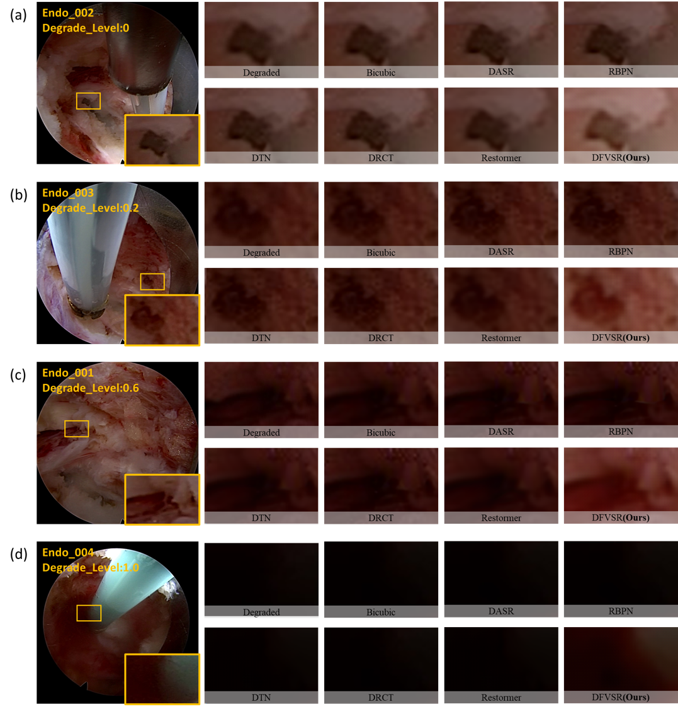

# <center>DFVEN: Degrade Aware and Flow Guided Model for Real-time High-frame-rate PELD Endoscopic Video Enhancement</center>

## <center>Handing Xu, Zhenguo Nie, Huimin Pan, Yanjie Xu, Tianmu Wang, Yunzhi Chen, and Xin-Jun Liu</center>
## <center>State Key Laboratory of Tribology in Advanced Equipment, Tsinghua University</center>

___

>**Abstract:** *In percutaneous endoscopic lumbar discectomy for lumbar disc herniation and lumbar spinal stenosis, intraoperative endoscopic image quality is often impaired due to the confined surgical area and the aquatic operating environment. Therefore, we investigated the identification of the image degradation inherent to the environment of spinal endoscopic surgery, and proposed a degradation representation encoder guiding the enhancement direction. We further constructed a deep learning model for real-time endoscopic video enhancement named DFVEN, which leverages the information from our degradation model and the continuity of video frames. Our approach comprehensively integrates the degradation characteristics and video sequence information to enhance image quality effectively. We implemented the proposed deep learning model in a real surgical imaging system and demonstrated its exceptional performance in enhancing high-frame-rate endoscopic images, significantly improving visual quality and aiding in more accurate and safer surgical procedures.*

___

### Network Architecture





### Installation

This repository is built in PyTorch 2.2.1 and tested on Windows 11 environment (Python3.10, CUDA12.3).
Follow these intructions

1. Clone our repository
```
git clone https://github.com/ilk123/DFVEN.git
cd DFVEN
```

2. Make conda environment
```
conda create -n pytorch221 python=3.10
conda activate pytorch221
```

3. Install dependencies
```
conda install pytorch torchvision torchaudio pytorch-cuda=12.1 -c pytorch -c nvidia
pip install cupy-cuda12x imageio lmdb matplotlib numpy opencv-python pillow pyyaml scikit-learn scikit-image yaml tqdm scipy lpips
```

### Demo

To test the pre-trained Restormer models of [Endoscopic](), [Blur](), [Noise](), [Low-light](), and [Red]() on your own images, you can either use command line as following
```
python demo.py --mode test --degrade_type Degrade_Type --model model_to_use --input_dir path_to_images_folders --pertrained_model path_to_pertrained_model --result_dir save_images_here
```
Example usage to perform noise enhancement on a directory of images:
```
python demo.py --mode test --degrade_type noise --model DFVEN --input_dir './test/noise/0' --pertrained_model './ckpt/noise.ckpt' --result_dir './results/noise'
```
Example usage to perform endoscopic enhancement on multiple directory of images:
```
python demo.py --mode test --degrade_type endoscopic --model DFVEN_four --input_dir './test/endoscopic' --pertrained_model './ckpt/endoscopic.ckpt' --result_dir './results/endoscopic'
```

### Training and Evaluation

To train and evaluation the DFVEN models of different degradation types on your own images, you can either use command line as following: 

#### Training
```
python ./src/data/scripts/create_frame_lmdb.py --dataset Dataset_Name --data_type whether_degraded --raw_dir path_to_raw_dataset --lmdb_dir path_to_result_lmdb_file
python train.py --mode train --degrade_type Degrade_Type --model DFVEN --input_dir path_to_dataset_lmdb --opt_yaml path_to_opt_yaml_file
```

#### Evaluation
```
python test.py --model test --degrade_type Degrade_Type --model DFVEN --input_dir path_to_dataset --result_dir save_results_and_metrics_here
```

### Results

We evaluate and compare the actual enhancement performance of image quality on the PELD endoscopic surgery dataset under different technical routes. 




### Citation

If you use Restormer, please consider citing:

```


```

### Acknowledgment

This code is contributed on [LiteFlowNet](https://github.com/sniklaus/pytorch-liteflownet), [MoCo](https://github.com/facebookresearch/moco), and [RBPN](https://github.com/alterzero/RBPN-PyTorch). 
